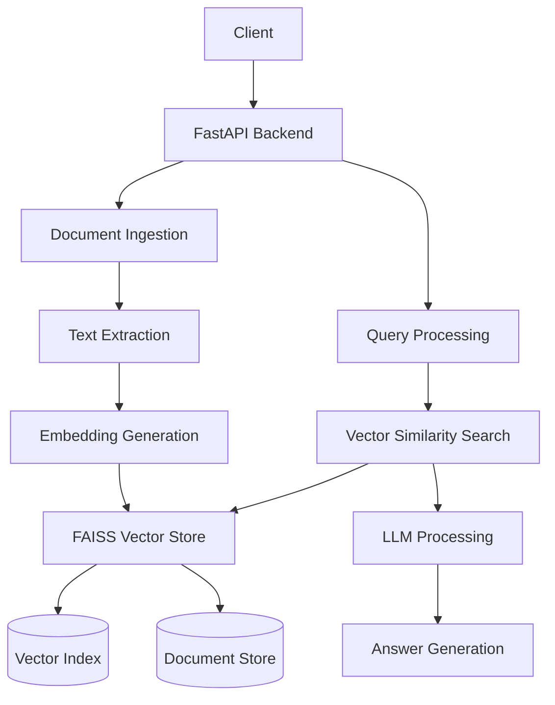

# Knowledge Base Search Backend

A powerful FastAPI-based backend service for document search and question answering using RAG (Retrieval Augmented Generation). This system combines vector similarity search with LLM-powered answer generation to provide accurate responses to queries based on ingested documents.

## Features

- Document ingestion for PDF and TXT files
- Vector similarity search using FAISS
- Multiple LLM support (OpenAI GPT-3.5 and Groq)
- Flexible embedding options (OpenAI, Sentence Transformers)
- REST API endpoints for querying and document ingestion
- Configurable top-k document retrieval
- Source attribution in responses

## System Architecture



## How it Works

1. **Document Ingestion**:
   - Documents (PDF/TXT) are uploaded via the `/ingest` endpoint
   - Text is extracted and converted into embeddings
   - Embeddings and original text are stored in FAISS vector store

2. **Query Processing**:
   - User queries are processed through the `/query` endpoint
   - System performs vector similarity search to find relevant documents
   - If enabled, LLM (OpenAI/Groq) generates a concise answer using retrieved context
   - Returns both the answer and relevant passages with similarity scores

## Getting Started

1. Install dependencies:
   ```bash
   pip install -r requirements.txt
   ```

2. Configure environment variables:
   - Set up OpenAI/Groq API keys if using LLM features
   - Configure embedding model preferences

3. Run the server:
   ```bash
   uvicorn app.main:app --reload
   ```

4. Access the API at `http://localhost:8000`

## API Endpoints

- `POST /ingest`: Upload and process documents
- `POST /query`: Search and retrieve answers
- `GET /stats`: View system statistics

## Configuration

The system supports multiple configuration options through environment variables:
- LLM provider selection (OpenAI/Groq)
- Embedding model configuration
- Vector store settings

## Testing & Development Tools

### Test Suite

The project includes a comprehensive test suite in the `tests/` directory:

#### API Tests (`test_api.py`)
- Tests all API endpoints including root, query, and ingest
- Validates request/response structures
- Handles various file types and error cases
- Tests API behavior with empty and populated knowledge base

#### Ingestion Tests (`test_ingest.py`)
- Tests document ingestion functionality
- Covers text and PDF file processing
- Tests directory-based ingestion
- Validates file type restrictions
- Tests chunking of large documents
- Handles edge cases (empty files, invalid formats)

#### Query Tests (`test_query.py`)
- Tests knowledge base querying functionality
- Validates passage retrieval and scoring
- Tests empty database scenarios
- Verifies document relevance scoring
- Tests top-k parameter functionality
- Ensures unique passage IDs

### Development Tools

#### Embedding Debugging (`debug_embeddings.py`)
A diagnostic tool to verify embedding functionality:
- Tests OpenAI and Sentence Transformer availability
- Generates embeddings for sample texts
- Computes similarity matrices between embeddings
- Validates embedding dimensions and uniqueness
- Helps debug embedding provider configuration

#### Test Interface (`test_interface.html`)
An interactive web interface for manual testing:
- Document upload interface for testing ingestion
- Interactive query interface with configurable parameters
- Real-time server health monitoring
- Display of search results with relevance scores
- Responsive design for easy testing across devices

#### Test Runner (`run_tests.py`)
A convenient script for running the test suite:
```bash
# Run all tests
python run_tests.py

# Run with verbose output
python run_tests.py --verbose

# Run with coverage report
python run_tests.py --coverage
```

Features:
- Automatic test discovery and execution
- Optional verbose output for detailed testing information
- Coverage reporting with HTML and terminal output
- Clear pass/fail status indication
- Environment validation

